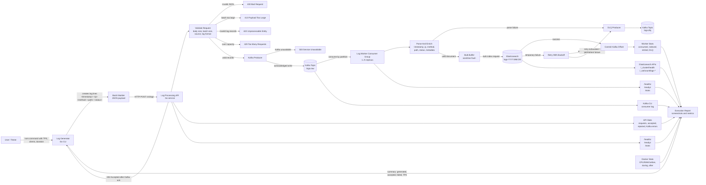
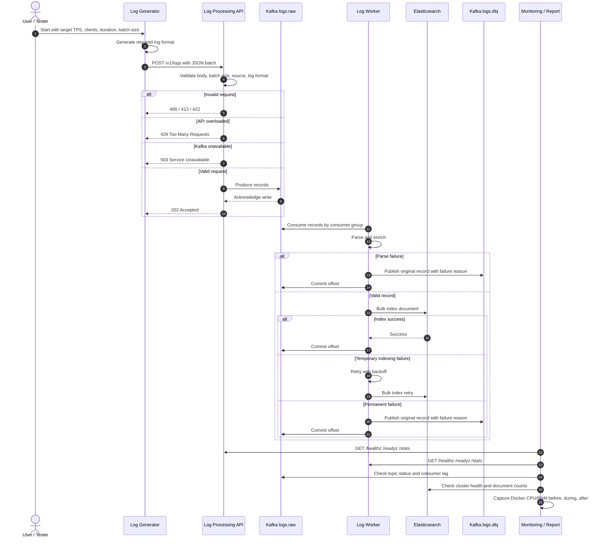

# Full Workflow Diagram

This diagram describes the complete flow from a user starting the log generator to logs being accepted, buffered, processed, stored, and observed.

```mermaid
flowchart LR
    User["User / Tester"] -->|runs command with TPS, clients, duration| Generator["Log Generator<br/>Go CLI"]

    Generator -->|creates log lines<br/>&lt;timestamp&gt; &lt;ip&gt; &lt;method&gt; &lt;path&gt; &lt;status&gt;| Batch["Batch Builder<br/>JSON payload"]
    Batch -->|HTTP POST /v1/logs| API["Log Processing API<br/>Go service"]

    API --> Validate["Validate Request<br/>body size, batch size,<br/>source, log format"]

    Validate -->|invalid JSON| BadRequest["400 Bad Request"]
    Validate -->|batch too large| TooLarge["413 Payload Too Large"]
    Validate -->|invalid log records| Invalid["422 Unprocessable Entity"]
    Validate -->|over capacity| Limited["429 Too Many Requests"]

    Validate -->|valid records| Producer["Kafka Producer"]
    Producer -->|Kafka unavailable| Unavailable["503 Service Unavailable"]
    Producer -->|acknowledged write| RawTopic[("Kafka Topic<br/>logs.raw")]

    API -->|202 Accepted after Kafka ack| Generator

    RawTopic -->|consume by partition| WorkerGroup["Log Worker Consumer Group<br/>1..N replicas"]
    WorkerGroup --> Parse["Parse And Enrich<br/>timestamp, ip, method,<br/>path, status, metadata"]

    Parse -->|parse failure| DLQProducer["DLQ Producer"]
    DLQProducer --> DLQ[("Kafka Topic<br/>logs.dlq")]

    Parse -->|valid document| BulkBuffer["Bulk Buffer<br/>size/time flush"]
    BulkBuffer -->|bulk index request| Elasticsearch[("Elasticsearch<br/>logs-YYYY.MM.DD")]

    Elasticsearch -->|success| Commit["Commit Kafka Offset"]
    Elasticsearch -->|temporary failure| Retry["Retry With Backoff"]
    Retry -->|retry succeeds| Commit
    Retry -->|retry exhausted / permanent failure| DLQProducer

    Commit --> StatsWorker["Worker Stats<br/>consumed, indexed,<br/>retried, DLQ"]

    API --> StatsAPI["API Stats<br/>requests, accepted,<br/>rejected, Kafka errors"]
    API --> HealthAPI["/healthz<br/>/readyz<br/>/stats"]
    WorkerGroup --> HealthWorker["/healthz<br/>/readyz<br/>/stats"]
    Elasticsearch --> ESHealth["Elasticsearch APIs<br/>/_cluster/health<br/>/_cat/count/logs-*"]
    RawTopic --> KafkaLag["Kafka CLI<br/>consumer lag"]

    StatsAPI --> Report["Execution Report<br/>screenshots and metrics"]
    StatsWorker --> Report
    HealthAPI --> Report
    HealthWorker --> Report
    ESHealth --> Report
    KafkaLag --> Report
    Generator -->|summary: generated,<br/>accepted, failed, TPS| Report
    DockerStats["Docker Stats<br/>CPU/RAM before,<br/>during, after"] --> Report
```

## Sequence View

```mermaid
sequenceDiagram
    autonumber
    actor User as User / Tester
    participant Gen as Log Generator
    participant API as Log Processing API
    participant Kafka as Kafka logs.raw
    participant Worker as Log Worker
    participant ES as Elasticsearch
    participant DLQ as Kafka logs.dlq
    participant Ops as Monitoring / Report

    User->>Gen: Start with target TPS, clients, duration, batch size
    Gen->>Gen: Generate required log format
    Gen->>API: POST /v1/logs with JSON batch
    API->>API: Validate body, batch size, source, log format

    alt Invalid request
        API-->>Gen: 400 / 413 / 422
    else API overloaded
        API-->>Gen: 429 Too Many Requests
    else Kafka unavailable
        API-->>Gen: 503 Service Unavailable
    else Valid request
        API->>Kafka: Produce records
        Kafka-->>API: Acknowledge write
        API-->>Gen: 202 Accepted
    end

    Worker->>Kafka: Consume records by consumer group
    Worker->>Worker: Parse and enrich

    alt Parse failure
        Worker->>DLQ: Publish original record with failure reason
        Worker->>Kafka: Commit offset
    else Valid record
        Worker->>ES: Bulk index document
        alt Index success
            ES-->>Worker: Success
            Worker->>Kafka: Commit offset
        else Temporary indexing failure
            Worker->>Worker: Retry with backoff
            Worker->>ES: Bulk index retry
        else Permanent failure
            Worker->>DLQ: Publish original record with failure reason
            Worker->>Kafka: Commit offset
        end
    end

    Ops->>API: GET /healthz /readyz /stats
    Ops->>Worker: GET /healthz /readyz /stats
    Ops->>Kafka: Check topic status and consumer lag
    Ops->>ES: Check cluster health and document counts
    Ops->>Ops: Capture Docker CPU/RAM before, during, after
```

